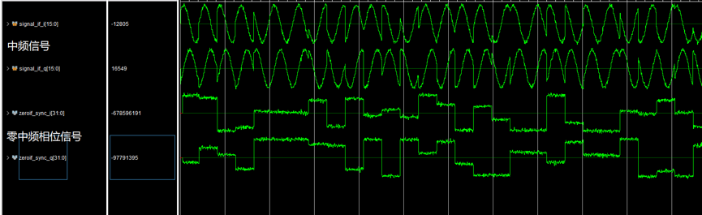
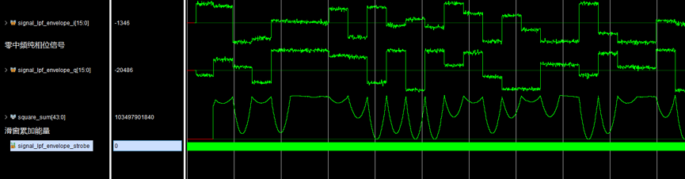
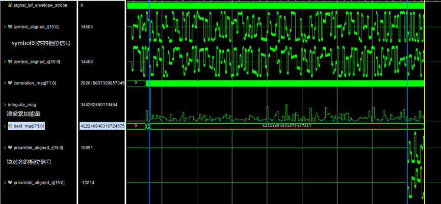
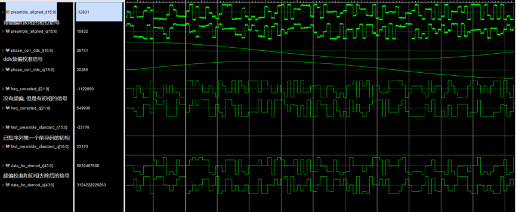

# Link 11 SLEW FPGA 调制解调器

[English](README.md)

这是一个可综合的 Link 11 SLEW FPGA 发送与接收链路开源实现. 项目覆盖帧构建, CRC, 卷积编码, 交织, 加扰, IQ 波形生成, 符号同步, 前导码相关, 频偏校正, QPSK 解调, Viterbi 译码和 CRC 校验.

项目面向 AMD/Xilinx Vivado, 使用 strobe 在高速系统时钟域内处理低速采样数据, 适用于互操作研究, 协议教学和 FPGA 调制解调模块复用.

接收架构经过两个月的 Codex 辅助设计, 仿真和反复上板调优, 已在维护者的测试环境中完成端到端硬件调试, 但尚未经过第三方独立复现.

> [!IMPORTANT]
> 本项目是独立研究实现, 尚未通过标准一致性, 实际部署, 安全关键或任务关键认证. 仓库不分发协议标准原文和厂商 IP.

## 主要特点

- 可综合的发送和接收数据链路.
- 接收数据链路经过实际 FPGA 上板迭代和验证.
- 2,400 baud SLEW 帧结构, 192-symbol 前导码和重插探测序列.
- Header 与 data 的 CRC-12 生成和校验.
- Tail-biting 卷积编码与 Viterbi 译码.
- QPSK 映射, 160-symbol 加扰和 IQ 波形生成.
- 符号边界搜索, 前导码相关和细频偏校正.
- 支持载波频偏, AWGN 和延迟多径的仿真信道.
- 参数化采样率和数据位宽, 并显式维护数据与控制延时.
- 使用 Tcl 自动重建 Vivado 工程和所需 Xilinx IP.

## 硬件验证

完整发射到接收回环已在 AMD/Xilinx ZU47DR 和维护者当前实验环境中通过. 对已经验证的测试向量:

- 发射波形在硬件上完成接收和端到端译码.
- 恢复出的编码/交织数据流观测到 `0` bit error.
- Viterbi 上报的最佳路径度量始终为 `0`, 与无误码编码流一致.

该结果来自两个月的工程师与 Codex 协同设计, 以及后续仿真, 反复上板测量, 延时对齐和架构优化. 在当前回环测试条件下, 结果超过项目依据协议设定的性能目标. 在完成标准化受损信道扫描, 可比基线和第三方复现之前, 本项目不把该结果表述为普适的 SOTA 结论.

零误码也代表交织和 Viterbi 纠错能力没有在这次干净回环中被实际触发. 在噪声, 衰落, 干扰或突发误码信道中, 这些协议机制仍然具有必要作用.

## 处理链路

```text
发送:
原始数据块 -> CRC/卷积编码 -> 帧调度 -> QPSK/加扰 -> 1800 Hz IQ 波形

接收:
IQ 采样 -> 下变频/包络检测 -> 符号对齐 -> 前导码相关
        -> 细频偏校正 -> 解扰/QPSK -> 解交织/Viterbi/CRC
```

接收顶层为 `link11_slew_demod_top.sv`, 发送顶层为 `tx/link11_slew_tx.sv`. `general/` 保存可复用的数学, RAM, 译码和频偏校正模块. 详细参数和延时请先查看 [`docs/module.md`](docs/module.md).

## 环境要求

- AMD/Xilinx Vivado 2024.1.
- 支持 DDS Compiler 6.0 和 CORDIC 6.0 的器件.
- SystemVerilog 支持.

参考器件为 `xczu47dr-ffve1156-2-i`. RTL 本身不绑定开发板, 但切换器件系列或 Vivado 版本后必须重新审核资源占用和 IP 延时.

## 快速开始

在仓库根目录执行:

```powershell
vivado -mode batch -source scripts/create_project.tcl
```

指定器件和输出目录:

```powershell
vivado -mode batch -source scripts/create_project.tcl -tclargs xczu47dr-ffve1156-2-i build/link11_slew
```

打开生成的工程:

```powershell
vivado build/link11_slew/link11_slew.xpr
```

脚本默认把 `link11_slew_demod_top` 设置为综合顶层, 把 `link11_slew_simulate` 设置为仿真顶层. 单独集成发送机时, 将综合顶层切换为 `link11_slew_tx`.

## 关键接口和参数

接收顶层参数:

| 参数 | 默认值 | 含义 |
| --- | ---: | --- |
| `DATA_WIDTH` | 16 | 输入 I/Q 和包络门限位宽 |
| `WINDOW_NUM` | 64 | 每个 2,400 baud symbol 的采样数 |
| `STANDARD_1800_PHASE_INC` | 1600 | 16-bit 相位步进, 计算式为 `round(1800 * 65536 / sample_rate)` |

输入 I/Q 使用二进制补码, `signal_if_strobe` 标记有效采样. 译码结果通过 `decoded_bits`, `decoded_length`, `viterbi_done`, `crc_check_pass` 和 `crc_check_strobe` 输出. `device_type=1` 选择 PICKET, `device_type=0` 选择 NCS.

发送顶层参数:

| 参数 | 默认值 | 含义 |
| --- | ---: | --- |
| `SAMPLE_CLK_NUM` | 1 | 每个输出 IQ 采样占用的系统时钟数 |
| `SYMBOL_SAMPLE_NUM` | 32 | 每个 2,400 baud symbol 的 IQ 采样数 |
| `CARRIER_PHASE_INC` | 1536 | 16-bit 1,800 Hz 载波相位步进 |

通过 `raw_data_valid` 写入 index `0` 的 header 和 index `1..15` 的 data block, 然后脉冲触发 `start_tx`. `tx_strobe` 表示输出 IQ 有效, `busy`, `done` 和 `tx_enable` 给出帧边界.

## 延时和集成注意

- 维护范围内的数据通路使用低有效同步复位 `rst_n`.
- 模块对延时敏感. 修改数学模块或 Xilinx IP 流水设置后, 必须重新对齐 strobe 和控制通路.
- 工程脚本把 DDS Compiler 延时固定为 7 clk. CORDIC 使用 maximum pipelining, 具体延时取决于器件和生成结果.
- 低速流水通常只在 strobe 或 clock enable 有效时推进. 有效采样延时不一定等于系统时钟延时.
- 位宽缩减一般取高位以保持有符号比例. 修改位宽参数后必须逐处复核截位.

## 仿真

`simulate/link11_slew_simulate.sv` 连接仿真发送机和接收机, 可配置载波频偏, 噪声, 多径, symbol 采样数和 data block 数量.

### 接收链路代表性波形

以下 Vivado 波形来自一次具有代表性的端到端仿真, 用于展示接收链路内部信号和实际调试过程. 它们属于实现与调试证据, 不等同于独立的标准一致性测试. 图片保留了截图中的原始波形和数值, 未对结果进行修改.

**1. 中频输入与零中频变换.** 1,800 Hz 中频 I/Q 输入经下变频后, 得到接收流水线使用的同步零中频 I/Q 信号.



**2. 零中频包络与滑窗能量.** 滤波后的零中频 I/Q 包络进入累积能量计算, 为后续捕获处理提供依据.



**3. Symbol 对齐与前导码捕获.** 对齐后的 I/Q 样本进入前导码相关器, 通过相关值, 积分值和峰值度量确定块对齐位置.



**4. 基于前导码的相位校正.** 已对齐的前导码驱动基于 DDS 的相位校正, 生成频偏校正后的 I/Q 样本以及送入解调级的数据流.



生成工程后运行 behavioral simulation, 重点观察 `crc_check_strobe`, `crc_check_pass` 和 `decoded_bits`. 当前仿真用于开发验证, 不是独立标准一致性测试套件.

## 参与贡献

提交 Pull Request 前请阅读 [CONTRIBUTING.md](CONTRIBUTING.md). 安全问题请按照 [SECURITY.md](SECURITY.md) 私下报告, 不要在公开 Issue 中披露敏感细节.

## 许可证

仓库原创源码采用 [Apache License 2.0](LICENSE). 第三方协议标准, Xilinx IP 和厂商生成文件遵循各自条款, 不包含在本仓库中.
